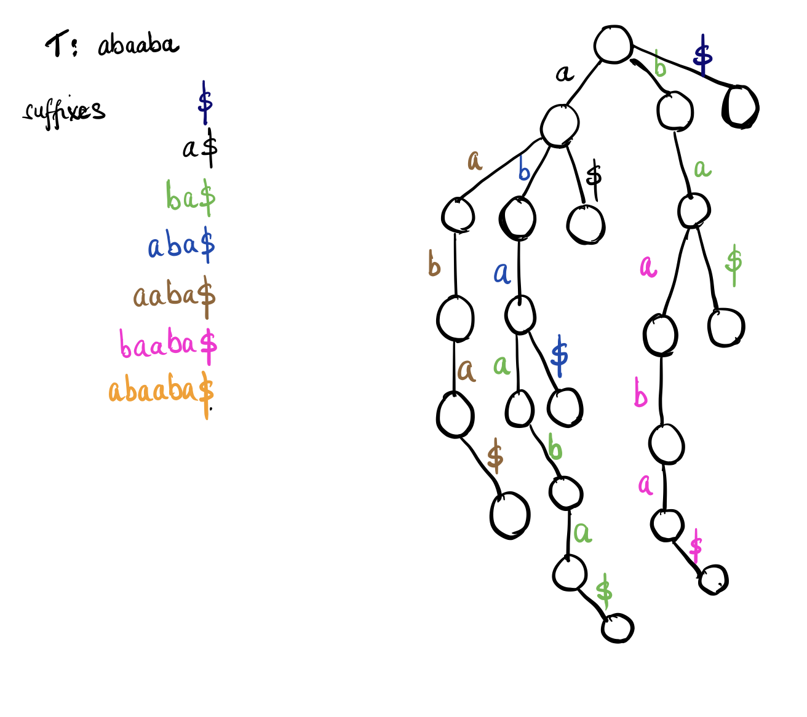

#### Suffix Trie


Some notes about Suffix Tries:

- Number of characters in suffixes of a text T with m characters is m(m+1)/2
  For example, a text T "ABCD" has the following suffixes:
  ```
  T : ABCD
      ABCD
       BCD
        CD
         D
  ```

- We introduce the idea of terminal character `$`, that does not appear anywhere in T and is lexicographically smaller than other alphabets. This guarantees that non suffix is a prefix of any other suffix.

- Each path from root to leaf represents a suffix; each suffix is represented by some path from root to leaf. Here is the suffix trie built for the string **T** : `abaaba`



